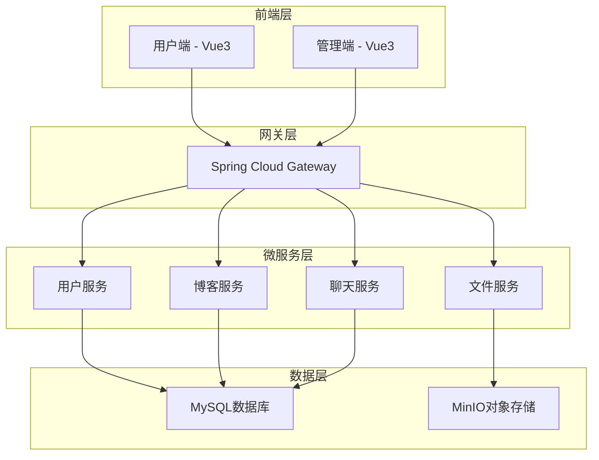
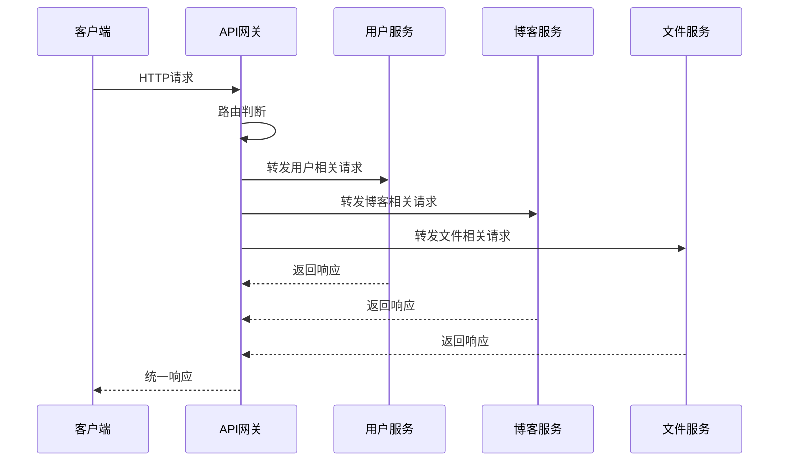

# IT技术社区分享平台开发文档

## 项目概述

IT技术社区分享平台是一个基于微服务架构的现代化技术交流平台，旨在为IT行业的开发者和爱好者提供一个交流、学习和分享的在线空间。项目采用前后端分离架构，包含用户端、管理端和微服务后端。

## 技术架构

### 整体架构图



## 项目结构

```
code-share-web/
├── code-share-project/          # 用户端前端项目
├── code-admin-project/          # 管理端前端项目
├── code-share-cloud/           # 后端微服务项目
│   ├── gateway/                # API网关
│   ├── common/                 # 公共模块
│   └── service/                # 微服务模块
│       ├── user-service/       # 用户服务
│       ├── blog-service/       # 博客服务
│       └── file-service/       # 文件服务
└── code_share.sql             # 数据库脚本
```

## 技术栈

### 后端技术栈
- **框架**: Spring Boot 2.3.9
- **微服务**: Spring Cloud Hoxton.SR10
- **网关**: Spring Cloud Gateway 2.2.9
- **数据库**: MySQL 8.0.31
- **ORM**: MyBatis Plus 3.4.1
- **对象存储**: MinIO 8.5.2
- **服务发现**: Nacos 2.2.5
- **API文档**: Knife4j 2.0.2
- **工具库**: Hutool 5.8.8, Lombok 1.18.16

### 前端技术栈
- **框架**: Vue 3.5.13
- **构建工具**: Vite 6.2.5
- **类型系统**: TypeScript 5.7.2
- **UI组件**: Element Plus 2.9.8/2.9.9
- **状态管理**: Pinia 3.0.2
- **路由**: Vue Router 4.5.0
- **HTTP客户端**: Axios 1.8.4
- **样式**: Tailwind CSS 4.1.4
- **Markdown**: ByteMD 1.22.0
- **实时通信**: WebSocket (SockJS)

## 数据库设计

### 核心数据表

#### 用户表 (user)
```sql
CREATE TABLE `user` (
  `id` int NOT NULL AUTO_INCREMENT COMMENT '用户唯一ID',
  `username` varchar(50) NOT NULL COMMENT '用户名',
  `password` varchar(255) NOT NULL COMMENT '加密后的密码',
  `email` varchar(100) NOT NULL COMMENT '用户邮箱',
  `avatar_url` varchar(255) DEFAULT NULL COMMENT '用户头像URL',
  `role` int NOT NULL DEFAULT 0 COMMENT '用户角色：0-普通用户，1-管理员',
  `is_active` int DEFAULT 0 COMMENT '账号状态：0-启用，1-禁用',
  `create_time` datetime DEFAULT CURRENT_TIMESTAMP COMMENT '账号创建时间',
  `update_time` datetime DEFAULT NULL ON UPDATE CURRENT_TIMESTAMP COMMENT '最后更新时间',
  `last_login` datetime DEFAULT NULL COMMENT '最后登录时间',
  PRIMARY KEY (`id`)
) COMMENT='用户信息表';
```

#### 板块表 (sections)
```sql
CREATE TABLE `sections` (
  `id` int NOT NULL AUTO_INCREMENT COMMENT '板块唯一ID',
  `name` varchar(100) NOT NULL COMMENT '板块名称',
  `icon` varchar(20) DEFAULT NULL COMMENT '图标',
  `description` text COMMENT '板块描述',
  `admin_id` int NOT NULL COMMENT '创建板块的管理员ID',
  `create_time` datetime DEFAULT CURRENT_TIMESTAMP COMMENT '板块创建时间',
  PRIMARY KEY (`id`)
) COMMENT='技术交流板块表';
```

#### 博客表 (blogs)
```sql
CREATE TABLE `blogs` (
  `id` int NOT NULL AUTO_INCREMENT COMMENT '博客唯一ID',
  `data_id` varchar(255) DEFAULT NULL COMMENT '文档id',
  `title` varchar(200) NOT NULL COMMENT '博客标题',
  `content` longtext NOT NULL COMMENT '博客内容（支持文字/图片/代码块）',
  `view_count` int DEFAULT 0 COMMENT '浏览数',
  `author_id` int NOT NULL COMMENT '作者ID',
  `likes_count` int DEFAULT 0 COMMENT '点赞数',
  `section_id` int NOT NULL COMMENT '所属板块ID',
  `status` int DEFAULT 0 COMMENT '状态：0-草稿，1-已发布',
  `version` int DEFAULT 1 COMMENT '当前版本号',
  `create_time` datetime DEFAULT CURRENT_TIMESTAMP COMMENT '博客创建时间',
  `update_time` datetime DEFAULT NULL ON UPDATE CURRENT_TIMESTAMP COMMENT '最后更新时间',
  PRIMARY KEY (`id`)
) COMMENT='技术博客表';
```

#### 问题表 (questions)
```sql
CREATE TABLE `questions` (
  `id` int NOT NULL AUTO_INCREMENT COMMENT '提问唯一ID',
  `title` varchar(200) NOT NULL COMMENT '提问标题',
  `content` text NOT NULL COMMENT '提问内容',
  `user_id` int NOT NULL COMMENT '提问者ID',
  `is_resolved` int DEFAULT 0 COMMENT '是否已解决：0-未解决，1-已解决',
  `create_time` datetime DEFAULT CURRENT_TIMESTAMP COMMENT '提问时间',
  `update_time` datetime DEFAULT NULL COMMENT '修改时间',
  PRIMARY KEY (`id`)
) COMMENT='技术问题提问表';
```

#### 回答表 (answers)
```sql
CREATE TABLE `answers` (
  `id` int NOT NULL AUTO_INCREMENT COMMENT '回答唯一ID',
  `content` text NOT NULL COMMENT '回答内容',
  `user_id` int NOT NULL COMMENT '回答者ID',
  `like_count` int DEFAULT NULL COMMENT '点赞数',
  `question_id` int NOT NULL COMMENT '关联的问题ID',
  `is_accepted` int DEFAULT 0 COMMENT '是否被采纳：0-未采纳，1-已采纳',
  `create_time` datetime DEFAULT CURRENT_TIMESTAMP COMMENT '回答时间',
  PRIMARY KEY (`id`)
) COMMENT='问题回答表';
```

#### 视频表 (videos)
```sql
CREATE TABLE `videos` (
  `id` int NOT NULL AUTO_INCREMENT COMMENT '视频唯一ID',
  `title` varchar(200) NOT NULL COMMENT '视频标题',
  `description` text COMMENT '视频描述',
  `video_path` varchar(255) NOT NULL COMMENT '视频存储路径',
  `cover_path` varchar(255) DEFAULT NULL COMMENT '封面图路径',
  `user_id` int NOT NULL COMMENT '上传用户ID',
  `is_published` int DEFAULT 1 COMMENT '上架状态：0-下架，1-上架',
  `create_time` datetime DEFAULT CURRENT_TIMESTAMP COMMENT '上传时间',
  `update_time` datetime DEFAULT NULL COMMENT '修改时间',
  `download_count` int DEFAULT NULL COMMENT '下载次数',
  `view_count` int DEFAULT 0 COMMENT '浏览次数',
  PRIMARY KEY (`id`)
) COMMENT='视频资源表';
```

#### 电子书表 (ebook)
```sql
CREATE TABLE `ebook` (
  `id` int NOT NULL AUTO_INCREMENT,
  `title` varchar(255) DEFAULT NULL,
  `description` varchar(255) DEFAULT NULL,
  `view_count` int DEFAULT 0,
  `image` varchar(255) DEFAULT NULL,
  `file_path` varchar(255) DEFAULT NULL,
  `is_published` int DEFAULT NULL,
  `create_time` datetime DEFAULT NULL,
  `update_time` datetime DEFAULT NULL,
  PRIMARY KEY (`id`)
);
```

#### 投票表 (votes)
```sql
CREATE TABLE `votes` (
  `id` int NOT NULL AUTO_INCREMENT COMMENT '投票唯一ID',
  `title` varchar(200) NOT NULL COMMENT '投票标题',
  `user_id` int NOT NULL COMMENT '发起用户ID',
  `vote_type` int DEFAULT 0 COMMENT '投票类型：0-单选，1-多选',
  `create_time` datetime DEFAULT CURRENT_TIMESTAMP COMMENT '创建时间',
  `end_time` datetime NOT NULL COMMENT '截止时间',
  PRIMARY KEY (`id`)
) COMMENT='投票信息表';
```

## 微服务架构

### 服务划分

#### 1. API网关 (gateway)
- **端口**: 18000
- **功能**: 
  - 统一入口，路由转发
  - 跨域处理
  - 白名单配置
  - 负载均衡

#### 2. 用户服务 (user-service)
- **功能**: 
  - 用户注册/登录
  - 用户信息管理
  - 权限验证
  - 用户状态管理

#### 3. 博客服务 (blog-service)
- **功能**: 
  - 博客发布/编辑
  - 问答系统
  - 评论管理
  - 点赞功能
  - 板块管理
  - 投票系统
  - 关注功能
  - 数据统计

#### 4. 文件服务 (file-service)
- **功能**: 
  - 文件上传/下载
  - 图片处理
  - 视频管理
  - 电子书管理
  - MinIO集成

#### 5. 聊天服务 (chat-service)
- **功能**: 
  - WebSocket实时通信
  - AI聊天功能
  - 消息推送

### 服务间通信



## 前端项目

### 用户端 (code-share-project)

#### 主要功能模块
1. **首页**: 内容展示、分类导航
2. **博客系统**: 发布、编辑、阅读博客
3. **问答系统**: 提问、回答、采纳
4. **视频中心**: 视频上传、播放、管理
5. **电子书**: 电子书浏览、下载
6. **投票系统**: 创建投票、参与投票
7. **用户中心**: 个人信息、关注管理
8. **AI聊天**: 智能问答功能

#### 技术特点
- Vue 3 Composition API
- TypeScript 类型安全
- Element Plus UI组件
- Tailwind CSS 样式
- ByteMD Markdown编辑器
- WebSocket 实时通信
- Pinia 状态管理

#### 项目结构
```
src/
├── components/          # 组件
│   ├── auth/           # 认证相关
│   ├── chat/           # 聊天组件
│   ├── content/        # 内容组件
│   ├── layout/         # 布局组件
│   ├── markdown/       # Markdown组件
│   ├── question/       # 问答组件
│   └── sidebar/        # 侧边栏组件
├── views/              # 页面视图
│   ├── blog/           # 博客相关
│   ├── chat/           # 聊天页面
│   ├── ebook/          # 电子书
│   ├── editor/         # 编辑器
│   ├── home/           # 首页
│   ├── poll/           # 投票
│   ├── question/       # 问答
│   └── video/          # 视频
├── services/           # API服务
├── stores/             # 状态管理
├── router/             # 路由配置
└── utils/              # 工具函数
```

### 管理端 (code-admin-project)

#### 主要功能模块
1. **仪表盘**: 数据概览、统计图表
2. **用户管理**: 用户列表、状态管理
3. **板块管理**: 板块创建、编辑
4. **文档中心**: 电子书管理
5. **视频中心**: 视频资源管理
6. **数据统计**: 详细数据分析

#### 技术特点
- Vue 3 + TypeScript
- Element Plus 管理界面
- ECharts 数据可视化
- 响应式布局
- 权限控制

#### 项目结构
```
src/
├── views/              # 页面视图
│   ├── dashboard/      # 仪表盘
│   ├── documents/      # 文档管理
│   ├── login/          # 登录页
│   ├── section/        # 板块管理
│   ├── stats/          # 数据统计
│   ├── user/           # 用户管理
│   └── videos/         # 视频管理
├── api/                # API接口
├── components/         # 组件
├── layout/             # 布局
├── router/             # 路由
└── utils/              # 工具
```

## 部署配置

### 环境要求
- JDK 1.8+
- Node.js 16+
- MySQL 8.0+
- MinIO (对象存储)
- Nacos (服务发现)

### 配置文件

#### 网关配置 (application.yml)
```yaml
spring:
  cloud:
    gateway:
      globalcors:
        cors-configurations:
          '[/**]':
            allowed-origins:
              - "http://localhost:5173"
              - "http://localhost:5175"
            allowed-methods:
              - GET
              - POST
              - PUT
              - DELETE
              - OPTIONS
            allowed-headers: "*"
            allow-credentials: true
      routes:
        - id: user-service
          uri: lb://user-service
          predicates:
            - Path=/user/**,/admin/user/**
        - id: blog-service
          uri: lb://blog-service
          predicates:
            - Path=/blog/**,/sections/**,/ebook/**,/video/**,/chat/**,/questions/**,/comment/**,/votes/**,/follow/**,/dashboard/**
        - id: file-service
          uri: lb://file-service
          predicates:
            - Path=/file/**
```

#### 数据库配置
```yaml
spring:
  datasource:
    driver-class-name: com.mysql.cj.jdbc.Driver
    url: jdbc:mysql://localhost:3306/code_share
    username: root
    password: 123456
```

#### MinIO配置
```yaml
minio:
  endpoint: http://110.42.213.154:9000
  accessKey: admin
  secretKey: password
  bucketName: code-share
```

## API接口文档

### 用户相关接口

#### 用户登录
```http
POST /user/login
Content-Type: application/json

{
  "username": "admin",
  "password": "123456"
}
```

#### 用户注册
```http
POST /user/register
Content-Type: application/json

{
  "username": "newuser",
  "password": "password123",
  "email": "user@example.com"
}
```

### 博客相关接口

#### 获取博客列表
```http
GET /blog/page?page=1&size=10&sectionId=1
```

#### 发布博客
```http
POST /blog/publish
Content-Type: application/json
Authorization: Bearer {token}

{
  "title": "博客标题",
  "content": "博客内容",
  "sectionId": 1
}
```

### 问答相关接口

#### 获取问题列表
```http
GET /questions/page?page=1&size=10
```

#### 发布问题
```http
POST /questions/publish
Content-Type: application/json
Authorization: Bearer {token}

{
  "title": "问题标题",
  "content": "问题内容"
}
```

### 文件相关接口

#### 上传文件
```http
POST /file/upload
Content-Type: multipart/form-data
Authorization: Bearer {token}

file: [文件]
```

## 开发指南

### 本地开发环境搭建

#### 1. 后端开发环境
```bash
# 1. 启动MySQL数据库
# 2. 启动MinIO对象存储
# 3. 启动Nacos服务发现
# 4. 导入数据库脚本
mysql -u root -p < code_share.sql

# 5. 启动微服务
cd code-share-cloud
mvn clean install
# 依次启动: gateway, user-service, blog-service, file-service
```

#### 2. 前端开发环境
```bash
# 用户端
cd code-share-project
npm install
npm run dev

# 管理端
cd code-admin-project
npm install
npm run dev
```

### 开发规范

#### 代码规范
- 使用ESLint进行代码检查
- 遵循Vue 3 Composition API规范
- TypeScript严格模式
- 统一的命名规范

#### Git提交规范
```
feat: 新功能
fix: 修复bug
docs: 文档更新
style: 代码格式调整
refactor: 代码重构
test: 测试相关
chore: 构建过程或辅助工具的变动
```

### 测试账号

#### 管理员账号
- 用户名: admin
- 密码: 123456

#### 普通用户账号
- 用户名: user
- 密码: 123456

## 功能特性

### 核心功能
1. **用户系统**: 注册、登录、权限管理
2. **内容管理**: 博客发布、问答系统
3. **资源分享**: 视频上传、电子书管理
4. **互动功能**: 评论、点赞、关注
5. **投票系统**: 创建投票、参与投票
6. **实时通信**: WebSocket聊天、AI问答
7. **管理后台**: 数据统计、内容审核

### 技术亮点
1. **微服务架构**: 服务拆分、独立部署
2. **前后端分离**: Vue 3 + Spring Boot
3. **实时通信**: WebSocket + STOMP
4. **对象存储**: MinIO分布式存储
5. **响应式设计**: 移动端适配
6. **Markdown支持**: 富文本编辑
7. **AI集成**: 智能问答功能

## 性能优化

### 前端优化
- 组件懒加载
- 图片懒加载
- 代码分割
- 缓存策略

### 后端优化
- 数据库索引优化
- 连接池配置
- 缓存机制
- 异步处理

## 安全措施

### 认证授权
- JWT Token认证
- 角色权限控制
- 接口白名单
- 跨域安全配置

### 数据安全
- 密码加密存储
- SQL注入防护
- XSS攻击防护
- 文件上传安全

## 监控运维

### 日志管理
- 统一日志格式
- 日志分级记录
- 错误日志追踪

### 性能监控
- 接口响应时间
- 数据库性能
- 服务器资源监控

## 扩展计划

### 功能扩展
1. 移动端APP
2. 消息推送系统
3. 积分系统
4. 直播功能
5. 在线编程环境

### 技术升级
1. 容器化部署
2. 微服务治理
3. 分布式缓存
4. 消息队列
5. 搜索引擎

## 常见问题

### Q: 如何修改数据库连接配置？
A: 修改各服务的application.yml文件中的数据库配置。

### Q: 如何添加新的微服务？
A: 在service模块下创建新的子模块，配置相应的依赖和路由。

### Q: 如何部署到生产环境？
A: 建议使用Docker容器化部署，配置Nginx反向代理。

### Q: 如何扩展AI聊天功能？
A: 在chat-service中集成更多的AI模型API。

## 联系方式

如有问题或建议，请联系开发团队。

---

*本文档最后更新时间: 2025年1月*
